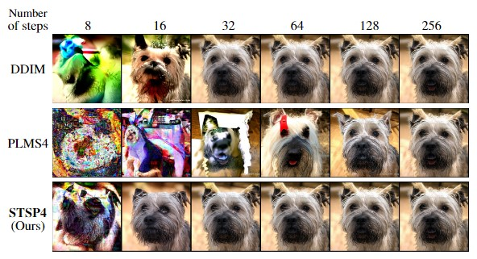
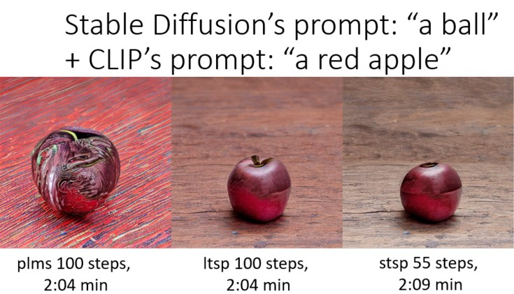

# Accelerating Guided Diffusion Sampling with Splitting Numerical Methods
The Official implementation for 

**Accelerating Guided Diffusion Sampling with Splitting Numerical Methods** (2023)

by Suttisak Wizadwongsa and Supasorn Suwajanakorn.

[ArXiv](https://arxiv.org/abs/2301.11558), [OpenReview](https://openreview.net/forum?id=F0KTk2plQzO) 

_Abstrace_: Guided diffusion is a technique for conditioning the output of a diffusion model at sampling time without retraining the network for each specific task. One drawback of diffusion models, however, is their slow sampling process. Recent techniques can accelerate unguided sampling by applying high-order numerical methods to the sampling process when viewed as differential equations. On the contrary, we discover that the same techniques do not work for guided sampling, and little has been explored about its acceleration. This paper explores the culprit of this problem and provides a solution based on operator splitting methods, motivated by our key finding that classical high-order numerical methods are unsuitable for the conditional function. Our proposed method can re-utilize the high-order methods for guided sampling and can generate images with the same quality as a 250-step DDIM baseline using 32-58% less sampling time on ImageNet256. We also demonstrate usage on a wide variety of conditional generation tasks, such as text-to-image generation, colorization, inpainting, and super-resolution.



This repository is based on [openai/improved-diffusion](https://github.com/openai/improved-diffusion) and [crowsonkb/guided-diffusion](https://github.com/crowsonkb/guided-diffusion), with modifications on sampling method.

# Installation
Clone this repository and run:
```
pip install -e .
```
This should install the python package that the scripts depend on.

# Download pre-trained models
All checkpoints of diffusion and classifier models are provided in [this](https://github.com/openai/guided-diffusion#download-pre-trained-models).

# Split classifier-guided diffusion.
For this code version, user need to download pretrain models and change the models' location in `config.py`.
The output directly can be cange in `scripts/classifier_sample.py`

```
python scripts/classifier_sample.py --model=u256 --method=stps4 --timestep_rp=20
```

Some example of `--method` options are ```stsp4, stsp2, ltsp4, ltsp2, plms4, plms2, ddim ```

- 128x128 model: `--model=c128`
- 256x256 model: `--model=c256`
- 256x256 model (unconditional): `--model=u256`
- 512x512 model: `--model=c512`

# Other tasks
For detailed usage example, see the notebooks directory.

- **CLIP-guided Stable Diffusion**: [![][colab]][SD-clip] This notebook shows how to use Splitting Numerical Methods with CLIP-guided Stable Diffusion.

[colab]: <https://colab.research.google.com/assets/colab-badge.svg>
[SD-text2im]: <https://colab.research.google.com/drive/1uDArGUikVwuNVPX6KRVnSxIjfd6vJeZ1?usp=sharing>


- **DreamBooth Stable Diffusion**: [![][colab]][SD-dream] This notebook shows how to use Splitting Numerical Methods with fine-tuned Stable Diffusion.

[colab]: <https://colab.research.google.com/assets/colab-badge.svg>
[SD-clip]: <https://colab.research.google.com/drive/1uDArGUikVwuNVPX6KRVnSxIjfd6vJeZ1?usp=sharing>
[SD-dream]: <https://colab.research.google.com/drive/1xm3JZgh_DR6GJnlmmcz36SiLZ0ECVVqp?usp=sharing>
